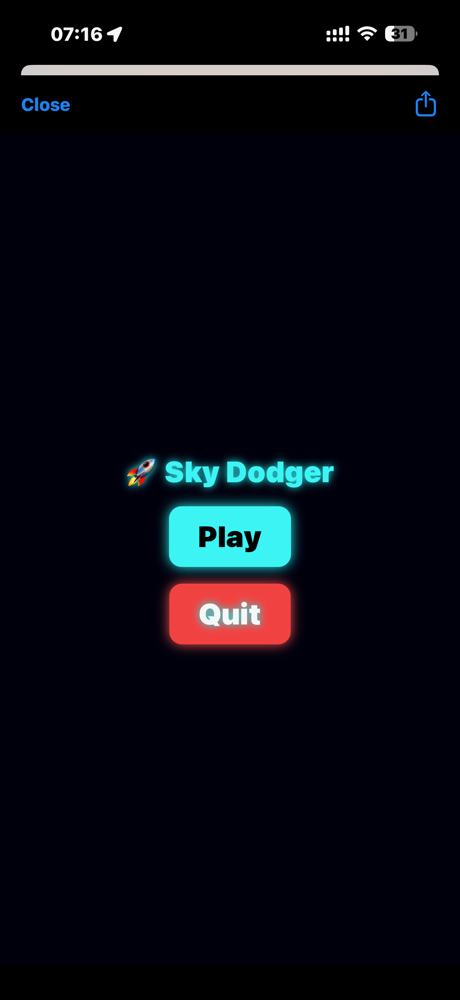
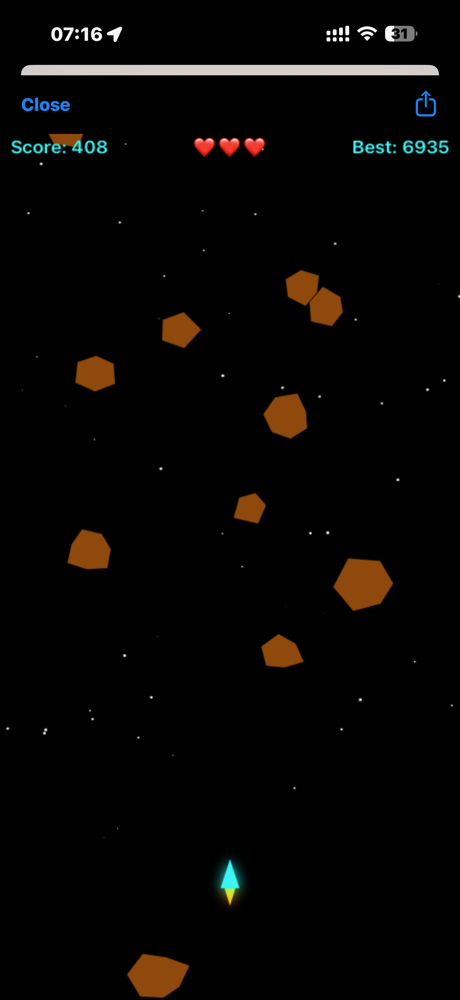

## 🎮 Sky Dodger

```text
 ____  _          ____            _                 
/ ___|| | ___   _|  _ \  ___   __| | __ _  ___ _ __ 
\___ \| |/ / | | | | | |/ _ \ / _` |/ _` |/ _ \ '__|
 ___) |   <| |_| | |_| | (_) | (_| | (_| |  __/ |   
|____/|_|\_\\__, |____/ \___/ \__,_|\__, |\___|_|   
            |___/                   |___/           

# 🚀 Sky Dodger – A Mini iOS Game in Scriptable

Sky Dodger is a small **arcade-style dodging game** built entirely in [Scriptable](https://scriptable.app/) for iOS.  
You control a tiny spaceship with your finger and try to dodge falling space rocks as long as possible.  

The game keeps track of your **best score**, which is saved to iCloud and displayed in a **home screen widget** with a starry background and spaceship.

---

## ✨ Features

- 🎮 **Touch controls** – drag your finger to move the ship around the screen.  
- ⭐ **Starfield background** – dynamic stars create a space atmosphere.  
- 🪨 **Falling asteroids** – rocks get faster and spawn more often as your score increases.  
- ❤️ **Lives system** – you get 3 hits before Game Over.  
- 🏆 **High score tracking** – your best score is saved in iCloud.  
- 📱 **Home screen widget** – shows your best score with a starry space background and spaceship.  
- ❌ **Quit button** – exit the game cleanly and save your score.

---

## 📂 Repository Structure

```text
SkyDodger/
├── 🚀 Sky Dodger.js        # Main game script (WebView-based game)
├── 💾 SkyDodger Closer.js  # Helper script to save score + close Scriptable
├── 📱 SkyDodgerWidget.js   # Widget script for home screen best score display
├── 🧪 TestKeychain.js       # Script to verify Keychain storage functionality
└── 📖 README.md            # This file
```
---

## 🎮 How to Play

1. Install [Scriptable](https://scriptable.app/) on your iPhone or iPad.  
2. Copy the three scripts into Scriptable:  
   - `Sky Dodger`  
   - `SkyDodger Closer`  
   - `SkyDodgerWidget`  
3. Add the **SkyDodgerWidget** as a Scriptable widget to your home screen.  
4. Tap **Play** to start the game.  
   - 🚀 Drag your finger to move the spaceship.  
   - 🪨 Dodge the falling rocks.  
   - ⭐ Survive as long as you can!  
5. Tap **Quit** to exit and save your score.

---
## 🎮 Controls
👆 Finger → Move the spaceship
⬆️⬇️⬅️➡️ Your finger = Ship movement
💥 Don’t touch the falling rocks!

👉 Simple rule: Where your finger goes, the ship follows.

---


## 🏆 Score Saving & Widget

- Best score is securely stored in the iOS Keychain (no longer editable in iCloud).
- A test script (`TestKeychain.js`) is included to verify Keychain functionality and ensure scores are stored correctly.
- The widget (`SkyDodgerWidget.js`) reads this value and shows:  
- Your **all-time best score**  
- A **starry space background** with the cyan spaceship  
- Each time the widget refreshes, the starfield is randomly generated.

---

## 📸 Screenshots & Preview





### Gameplay


### Widget Example


---

## ⚙️ Requirements

- iOS with [Scriptable](https://scriptable.app/) installed  
- iCloud enabled for Scriptable (for saving scores and widget sync)  

---

## 📜 License

This project is released under the MIT License.  
You’re free to use, modify, and share — just give credit.

---

## 🚀 Credits

Created in Scriptable with pure **JavaScript + HTML5 Canvas**.  
Inspired by classic space dodging games.
